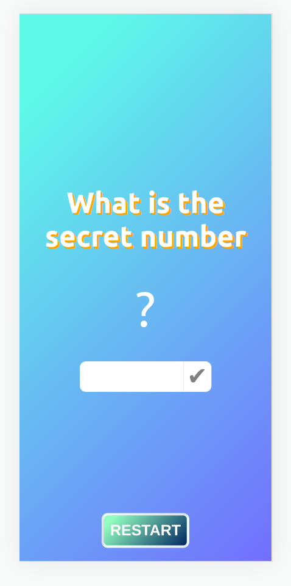

# Random number game

Create a React component called NumberGame that displays a random integer between 1 and 100, inclusive. The user can
input their guess in an input field and click a button to submit their guess. If the guess is correct, display a message
that says "You win!". If the guess is incorrect, display a message that says "Try again!" and update the display to show
whether the guess was too high or too low. The user should be able to keep guessing until they get the correct answer.

